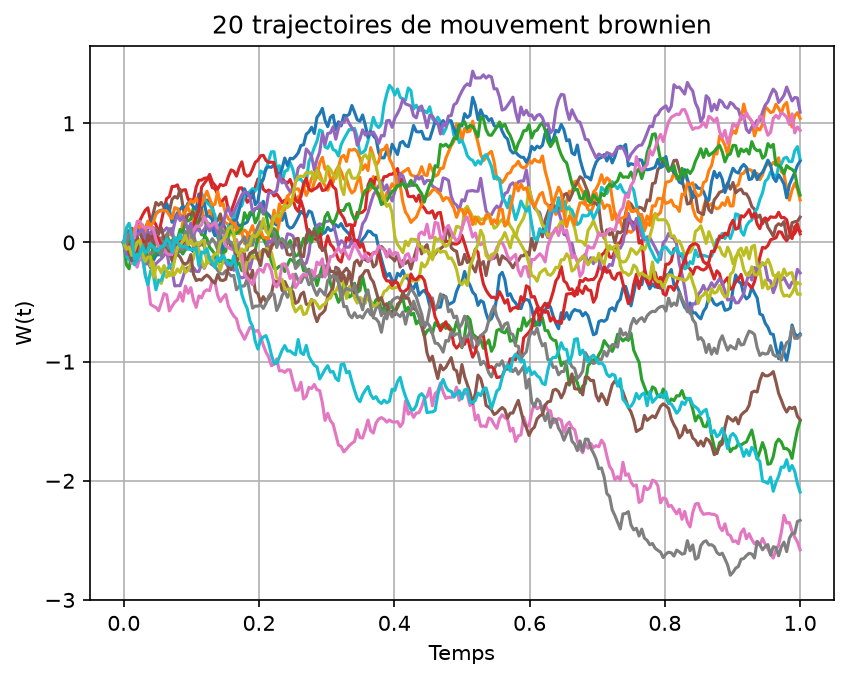
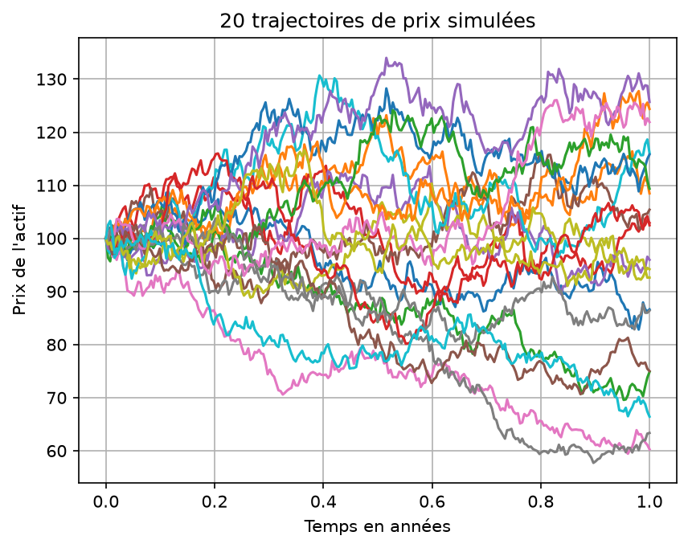
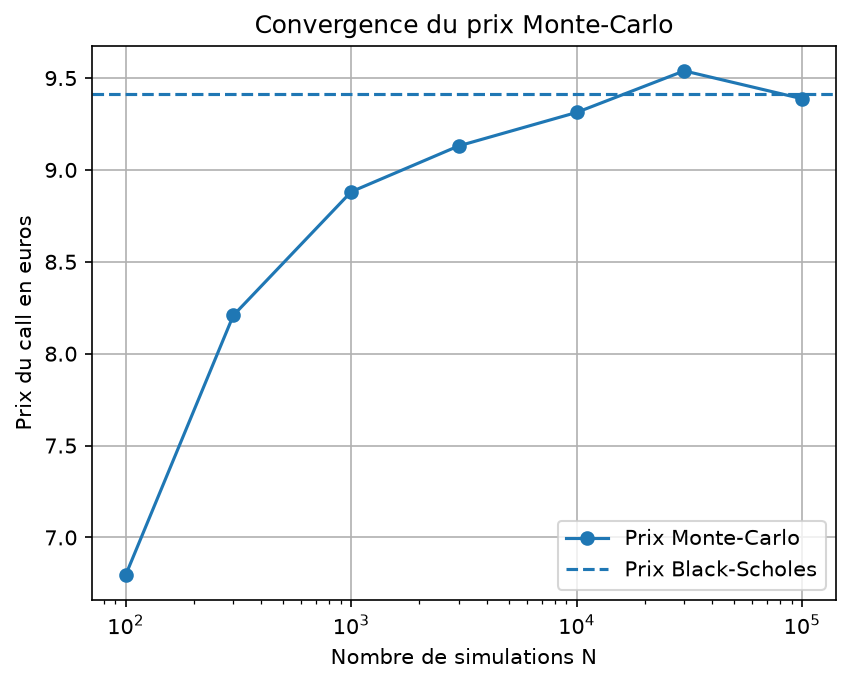
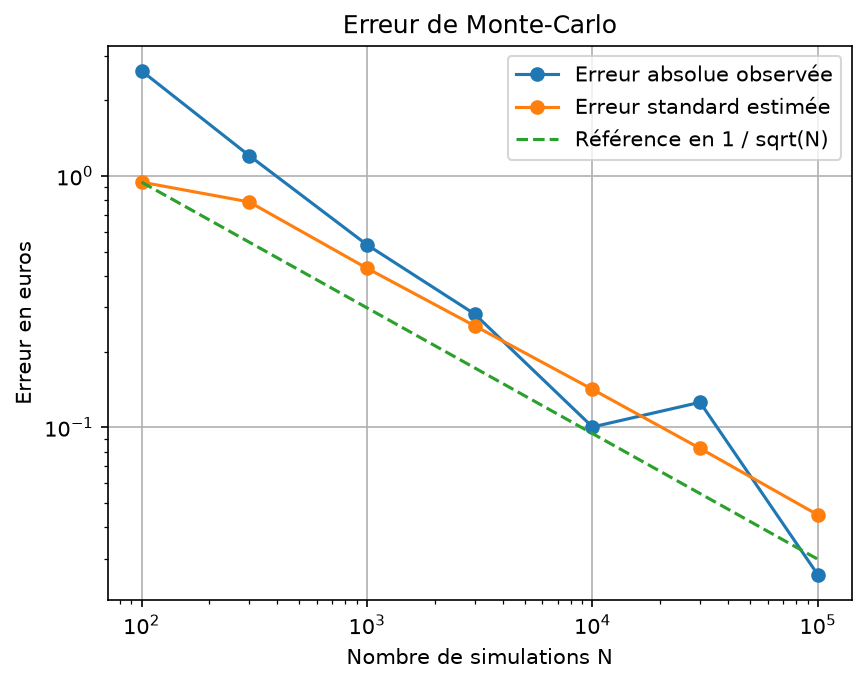

# Monte Carlo Option Pricer

A Python project for pricing European call and put options using
Monte Carlo simulation.

The project also implements the closed-form Black-Scholes formula
and an antithetic variance reduction method.

## Objectives

This project was developed to understand:

- European call and put payoffs
- Brownian motion
- Geometric Brownian motion
- Risk-neutral option pricing
- Monte Carlo simulation
- Black-Scholes pricing
- Monte Carlo convergence
- Variance reduction with antithetic variables

## Financial concepts

A European call option gives its holder the right to buy an asset
at the strike price `K` at maturity `T`.

Its payoff is:

```text
max(S_T - K, 0)
```

A European put option gives its holder the right to sell the asset
at the strike price `K`.

Its payoff is:

```text
max(K - S_T, 0)
```

Under the risk-neutral model, the asset price is simulated as:

```text
S_T = S_0 exp((r - sigma² / 2)T + sigma W_T)
```

The Monte Carlo price is the average discounted payoff:

```text
Option price = exp(-rT) × average payoff
```

## Project structure

```text
src/payoffs.py
```

Implements European call and put payoff functions.

```text
src/brownian.py
```

Simulates standard Brownian motion paths.

```text
src/gbm.py
```

Simulates asset prices using geometric Brownian motion.

```text
src/monte_carlo.py
```

Implements classical and antithetic Monte Carlo option pricing.

```text
src/black_scholes.py
```

Implements the Black-Scholes closed-form formulas.

## Installation

Create and activate a virtual environment:

```powershell
py -m venv .venv
.\.venv\Scripts\Activate.ps1
```

Install the dependencies:

```powershell
python -m pip install -r requirements.txt
```

## Example parameters

The examples use:

```text
Initial asset price S0 = 100
Strike K              = 100
Risk-free rate r      = 3%
Volatility sigma      = 20%
Maturity T            = 1 year
```

For these parameters, the theoretical Black-Scholes prices are
approximately:

```text
European call: 9.4134
European put:  6.4580
```

## Run the examples

Monte Carlo pricer:

```powershell
python mc_pricer_demo.py
```

Monte Carlo and Black-Scholes comparison:

```powershell
python comparison_demo.py
```

Convergence analysis:

```powershell
python convergence_demo.py
```

Antithetic variance reduction:

```powershell
python antithetic_demo.py
```

Run the project tests:

```powershell
python test_project.py
```

## Main results

The Monte Carlo price converges towards the Black-Scholes price
when the number of simulations increases.

The standard error decreases approximately as:

```text
1 / sqrt(N)
```

where `N` is the number of simulations.

The antithetic method reduces the variance by pairing each normal
shock `Z` with its opposite `-Z`.

## Limitations

The model assumes:

- constant volatility
- constant interest rate
- no dividends
- frictionless markets
- a log-normal asset price
- European exercise only

These assumptions are useful for learning but do not represent all
features of real financial markets.

## Variance reduction

For the example parameters, the antithetic estimator produced a
smaller standard error than the classical Monte Carlo estimator.

The exact reduction depends on the random seed and the option
parameters.

## Brownian motion simulation



## Geometric Brownian motion simulation



## Monte Carlo convergence



## Monte Carlo error

